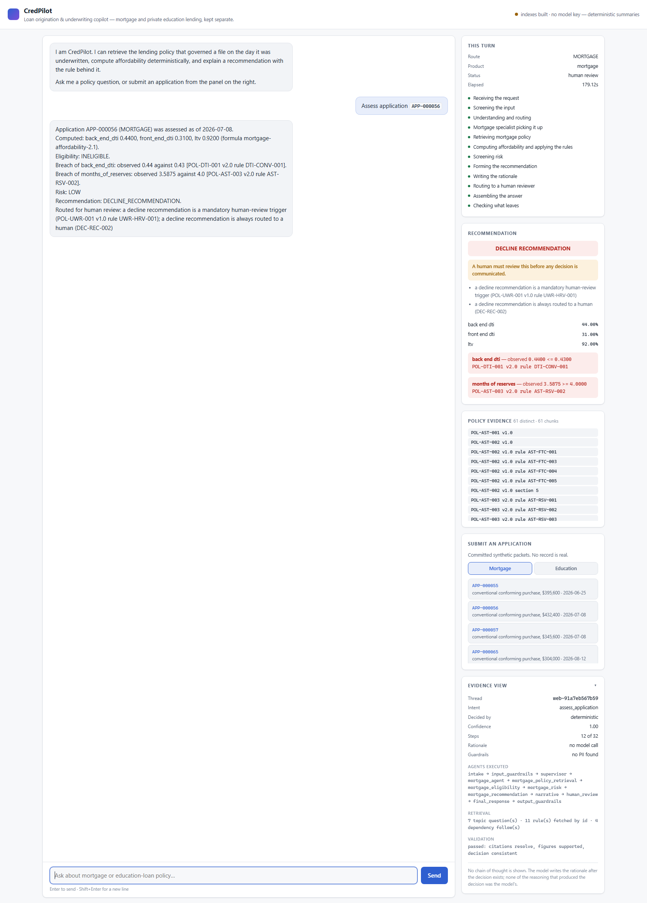
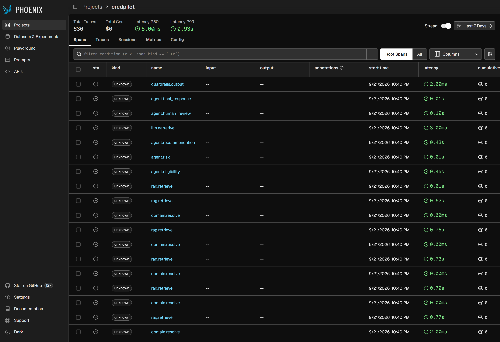

# CredPilot

> **Agentic AI Engineer Pathway — Cross-Cutting Capstone Hackathon**
> Business Case **BC-AAIE-HACK-02** · Domain: **Banking & Finance**
> Cross-cutting finale: Agentic Core + Context Engineering + MCP + Observability
> + Cost Governance + Security & Governance + Agent Evaluation
> Role: **Agentic AI Engineer**

**Loan Origination & Underwriting Copilot** — a LangGraph multi-agent system that
understands a request, routes it to the right lending product, retrieves the
policy that governed the file on the day it was underwritten, computes
affordability deterministically, screens risk, and drafts an auditable
recommendation with a human making the final call.

CredPilot underwrites **two independent lending products**: U.S. residential
mortgage and private education loans. Their AI infrastructure is shared; their
business knowledge is not, and the graph has no edge between them.

---

## Quick start

```bash
python -m venv .venv
.venv/Scripts/activate                 # source .venv/bin/activate on macOS/Linux
pip install -r requirements.txt

python scripts/build_policy_indexes.py                                    # ~30 s

python -m src.web                                                         # http://127.0.0.1:8000
python -m src.cli assess synthetic_data/mortgage/applications/APP-000056.json
python -m src.cli ask "What is the maximum back-end DTI on a jumbo mortgage?"
python -m src.cli chat
```



*`APP-000056` through the web UI: the decline, both breaches with the rule that
set each threshold, the 61 evidence chunks behind them, and the agent chain that
produced it. The status bar reads "no model key" because the committed
credential has no quota — the rationale is the deterministic summary, and says
so.*

No Docker. No database service. No hosted model or vector endpoint. Building the
indexes, retrieval, the CLI, the web UI, the retrieval evaluation and the tests
need **no API key** — they are deterministic and call no model.

One step does: the written rationale. Set `GOOGLE_API_KEY` in `.env` to enable
it. Without a key the system still decides every file and explains itself with a
deterministic summary, marked as one.

Full command reference: **[docs/rag/RUNBOOK.md](docs/rag/RUNBOOK.md)**.

---

## What it does, on one case

`APP-000056` and `APP-000057` are the same borrower profile, both computing to
exactly **44.00%** back-end debt-to-income, both underwritten on 2026-07-08:

```
APP-000056  back_end_dti 0.4400
            BREACH back_end_dti: 0.4400 <= 0.4300  [POL-DTI-001 v2.0 rule DTI-CONV-001]
            DECLINE_RECOMMENDATION — HUMAN REVIEW REQUIRED
              a decline recommendation is always routed to a human (DEC-REC-002)

APP-000057  back_end_dti 0.4400
            ceiling extended to 45.00% on 3 documented compensating factors:
              verified reserves of 61.1 months (>= 6.0)
              representative credit score 744 (>= 720)
              loan-to-value 72.00% (<= 75%)
            APPROVE_RECOMMENDATION
```

`APP-000055` is the same ratio again on 2026-06-25, where `POL-DTI-001` **v1.0**
still governs and allows 45% unconditionally — so it clears the ceiling, and is
then referred anyway, because at 44% against a 45% limit it sits inside the
two-point borderline band `UWR-HRV-001` makes a mandatory review trigger.

Three files, one ratio, three outcomes, decided entirely by which policy version
retrieval returned and what each file documents.

Nothing in that is hardcoded. The 43%, the 45% extension, the two-factor minimum,
each factor's bar and the two-point band are all read out of the policy text the
retriever returned; remove the retrieved rule and the engine reports
INDETERMINATE rather than falling back to a number in the code.

---

## Where the model sits

Not where people usually assume.

```
supervisor  →  retrieval  →  calculation  →  rule engine  →  recommendation  →  narrative
└──────────────────────── deterministic ───────────────────────────────────┘    └ Gemini ┘
```

Gemini writes the **rationale**. It does not route, retrieve, rank, filter,
compute, compare against a threshold, or decide. By the time it is called the
outcome already exists and is handed to it as a fact, and there is no code path
by which its text changes the recommendation. Afterwards, every citation and
figure in the prose is checked back against the evidence it was given —
deterministically, with no model involved. A rationale that fails that check is
kept, marked unfaithful, and routed to a human.

Routing is deterministic too, and the same reasoning applies: an application
packet carrying `subject_property` is a mortgage *as a matter of fact*, and
asking a model to confirm it would introduce a way for the answer to be wrong.
Gemini is consulted only for genuinely ambiguous free text, is off by default,
and may only choose among six enumerated routes.

---

## The architecture

```
                         WEB UI  /  CLI
                               │
                            intake
                               │
                      input guardrails
                               │
                        SUPERVISOR  ──────────── understands, clarifies, routes
                               │
   ┌──────────┬────────────┬───┴────────┬─────────────┬──────────────┐
GENERAL    CLARIFY      MORTGAGE   EDUCATION_LOAN  HUMAN_REVIEW  OUT_OF_SCOPE
   │           │            │            │              │             │
   │      interrupt    mortgage_     education_         │             │
   │      (pauses)      agent          agent            │             │
   │           │            │            │              │             │
   │      user reply   policy        policy             │             │
   │           │       retrieval     retrieval          │             │
   │      SUPERVISOR       │            │               │             │
   │                  eligibility   eligibility         │             │
   │                       │            │               │             │
   │                     risk          risk             │             │
   │                       │            │               │             │
   │                  recommend     recommend           │             │
   │                       └──────┬─────┘               │             │
   │                          narrative                 │             │
   └───────────────────────────┬──┴─────────────────────┴─────────────┘
                     Final Response Agent   ── presents; never decides
                               │
                      output guardrails
                               │
                         WEB UI  /  CLI
```

Four properties the graph exists to enforce:

**A greeting never invokes RAG.** `general_response` has no edge to any
retrieval node, so this is unreachable rather than merely avoided.

**Product isolation is topological.** The two product chains share no node.
There is no sequence of routing decisions that reaches education retrieval from
a mortgage node, and `test_no_edge_crosses_between_the_two_products` asserts it
against the compiled graph rather than against intent.

**An ambiguous request is clarified, not guessed.** The run pauses on a
LangGraph `interrupt()` with the checkpoint intact; when the answer arrives the
original request is still on the thread and the pair is re-routed. Capped at two
rounds, after which a person takes it.

**The model never does the arithmetic.** Every figure comes from
`src/calculations.py` (`POL-DTI-001` rule `DTI-CALC-002`).

---

## The pieces

| | Where | What |
|---|---|---|
| **Supervisor** | [`src/supervisor.py`](src/supervisor.py) | six routes, deterministic-first classification, clarification |
| **LangGraph** | [`src/graph.py`](src/graph.py) | typed state, 20 nodes, two isolated product chains, SQLite checkpointer, interrupt/resume |
| **Web app** | [`src/web/`](src/web/) | FastAPI + one static page, SSE progress, evidence view |
| **CLI** | [`src/cli.py`](src/cli.py) | `assess`, `ask`, `chat`, `retrieve`, `mcp`, `corpus` |
| **MCP host + client** | [`src/mcp_host/`](src/mcp_host/) | discovery, timeouts, bounded retries, elicitation, sampling, roots |
| **MCP server** | [`mcp_server/`](mcp_server/) | 11 tools, 10 resources, 6 prompts over stdio |
| **Agentic-RAG tool** | [`src/tools/rag_tool.py`](src/tools/rag_tool.py) | hybrid product-isolated retrieval, retrieval-in-the-loop, rule-id fetch |
| **Retrieval subsystem** | [`src/rag/`](src/rag/) | parsers, chunking, embedding, Chroma, BM25, RRF, reranking, applicability, citations |
| **Deterministic math** | [`src/calculations.py`](src/calculations.py) | every underwriting figure, per product |
| **Rule engine** | [`src/rules.py`](src/rules.py), [`src/rule_families/`](src/rule_families/) | retrieved thresholds applied to computed figures, 17 families |
| **Review triggers** | [`src/review_triggers.py`](src/review_triggers.py) | `UWR-HRV-001`, the mandatory human-review routing table |
| **Narrative** | [`src/narrative.py`](src/narrative.py) | the model calls, each checked against its own evidence afterwards |
| **Resilience** | [`src/resilience.py`](src/resilience.py) | deadlines, bounded retries, typed failures, graceful degradation |
| **Context engineering** | [`src/context/`](src/context/) | write, select, compress, isolate — untrusted text in its own compartment |
| **Tiered memory** | [`src/memory/`](src/memory/) | short-term window + long-term semantic recall, scoped per subject |
| **Guardrails** | [`src/guardrails/`](src/guardrails/) | injection detection, quarantine, PII redaction |
| **Observability** | [`src/observability/`](src/observability/) | Phoenix/OTel spans with a thinking/acting/tool split, tool log, audit trail |
| **Evaluation** | [`eval/retrieval/`](eval/retrieval/), [`eval/agent/`](eval/agent/) | retrieval metrics; end-to-end accuracy with DeepEval LLM-as-judge |
| **Tests** | [`tests/`](tests/) | routing, supervisor, MCP capabilities, resilience, rule families, web API, and the retrieval suite |

---

## MCP

CredPilot is the **host**. It owns the Supervisor, the agents, the Gemini
integration, memory, checkpointing, the UI and observability.
[`src/mcp_host/client.py`](src/mcp_host/client.py) is the client it owns, and
[`mcp_server/`](mcp_server/) is a separate process reached over stdio.

```bash
python -m src.cli mcp        # connect and list the surface
python mcp_server/server.py  # run the server on its own
```

All six MCP capability families are implemented and tested against a real server
subprocess (`tests/test_mcp_capabilities.py`, 35 tests):

| Family | Role | What it is |
|---|---|---|
| **Tools** | primary | 11, each calling a real CredPilot service. No business logic in a handler and no threshold anywhere in the file. |
| **Resources** | primary | 10 read-only catalogues. No applicant data is reachable through any of them, asserted per resource. |
| **Prompts** | primary | 6 parameterised templates. No prompt hard-codes a threshold — asserted, because a number baked into a template is one no policy version can move. |
| **Elicitation** | controlled | Asks for the one missing routing fact against a two-field typed schema. Never for a credential. A client with no responder declines rather than answering for the user. |
| **Sampling** | compatibility | Served through Gemini and the model named in the response; a non-Gemini responder is refused. Normal operation does not use it, and a test asserts that. |
| **Roots** | compatibility | A four-directory allowlist. Explicitly not an authorization mechanism, and the server says so in its own response. |

Product isolation holds across the boundary exactly as it does in process: a
product-scoped tool with no product returns `PRODUCT_CLARIFICATION_REQUIRED`
rather than searching both corpora.

---

## Data

Entirely synthetic, generated by committed code from fixed seeds. No record is
real and no policy is any real lender's policy.

| | Mortgage | Education |
|---|---|---|
| Applications | 75 | 200 |
| Policy documents | 42 (6 at two versions) | 12 |
| Rules | 203 | 72 |
| Applicant documents | 1,140 | 18 |
| Golden cases | 75 | 20 |

See [`synthetic_data/README.md`](synthetic_data/README.md).

---

## Measured

### Retrieval

| Metric | Target | Measured |
|--------|--------|----------|
| Source documents indexed | all | 42/42 · 12/12 |
| Declared rules indexed | all | 174/174 · 72/72 |
| `cross_product_contamination_rate` | 0.00 | **0.0000** |
| `citation_validity` | 1.00 | **1.0000** |
| `policy_recall@5` (macro, authored) | ≥ 0.95 | **0.9932** |
| `rule_recall@5` (macro, authored) | ≥ 0.90 | **0.9756** |
| Temporal-version accuracy | 1.00 | **1.0000** |
| Prompt-injection policy override | 0.00 | **0.0000** |

### End to end

95 golden cases through the **whole** graph, entered at `intake` — so intake,
the input guardrail, the Supervisor's routing decision, the product specialist,
retrieval, the rules, the recommendation, the narrative, the response validator
and the output guardrail are all exercised on every case. Figures are macro-
averaged across products.

Current figures are in [`reports/eval_report.json`](reports/eval_report.json).
Read them beside `rule_coverage` in the same file, which states the ceiling
`outcome_accuracy` sits under for each product.

Two caveats travel with every accuracy figure and are repeated wherever they are
published: the data is synthetic and self-generated, so agreement with the
generator is not correctness; and the LLM judge shares a model family with the
system it grades. Every judged figure has a deterministic counterpart, and where
they disagree the deterministic one governs.

### Operational

[`reports/golden_signals.json`](reports/golden_signals.json) splits latency into
**thinking / acting / tool / retrieval** from real Phoenix spans, and takes
accuracy and hallucination rate from the evaluation. Each block states its
source, so a Phoenix-derived latency is never confused with an eval-derived
accuracy. The producing script reads
[`traces/phoenix_spans.jsonl`](traces/phoenix_spans.jsonl) — 1,119 spans over
318 traces, written by `scripts/export_traces.py` — or a running Phoenix
instance with `--phoenix`. The export covers both products, all six Supervisor
routes and two deliberately malformed packets, so the degraded paths NFR-04
claims are traced rather than asserted.

---

## Reproducing everything

**Install, and configure the environment.** The key is optional: everything
below except the narrative rationale and the LLM-as-judge is deterministic and
calls no model.

```bash
python -m venv .venv
.venv/Scripts/activate                 # source .venv/bin/activate on macOS/Linux
pip install -r requirements.txt
cp .env.example .env                   # then set GEMINI_API_KEY (or GOOGLE_API_KEY)
```

**Build the indexes.**

```bash
python scripts/build_policy_indexes.py
```

**Run the copilot** — web UI, one application, one question, a conversation.

```bash
python -m src.web
python -m src.cli assess synthetic_data/mortgage/applications/APP-000056.json
python -m src.cli assess synthetic_data/education/applications/APP-2026-00001.json
python -m src.cli ask "When is a cosigner required on a student loan?"
python -m src.cli chat
```

**The MCP server**, standalone and through the host's client.

```bash
python mcp_server/server.py
python -m src.cli mcp
```

**Test.** The second form skips anything that loads a model.

```bash
python -m pytest tests/ -q
python -m pytest tests/ -q -m "not slow"
```

**Regenerate the Phoenix traces.** Both products, all six Supervisor routes.

```bash
python scripts/export_traces.py
```

**Regenerate the evaluation.** `--no-judge` is listed first because it is the
one that runs *anywhere* — it needs no API key and refreshes every deterministic
metric, which is most of the report. `--judge-all` adds the DeepEval
LLM-as-judge pass and is the mode for a committed judged run; it **exits
non-zero and writes nothing** if the judge is unreachable, rather than
publishing a report labelled "every case judged" that judged none.

```bash
python -m eval.agent.run_agent_eval --no-judge
python -m eval.agent.run_agent_eval --judge-all
python -m eval.agent.run_agent_eval --judge-limit-per-product 10
python eval/retrieval/run_retrieval_eval.py
```

**Regenerate the golden signals and the dashboard** from those traces and that
evaluation.

```bash
python scripts/build_golden_signals.py
python scripts/build_dashboard.py
```

**Capture the Phoenix UI** showing those same spans.



*The `credpilot` project's span table: 636 traces, P50 8.00 ms, P99 0.93 s, and
the agent chain span by span — `agent.eligibility`, `agent.recommendation`,
`rag.retrieve`, `guardrails.output`, `llm.narrative`. Total cost reads $0
because no model call reached the provider; see the note on the dashboard.*

Playwright is a development dependency and deliberately not in
`requirements.txt` — nothing at runtime needs a browser. The script refuses
rather than writing a placeholder if Phoenix is unreachable, the project holds
no spans, or the page comes back an error: the first version of it
screenshotted Phoenix's "Internal Server Error" and reported success, which is
how the Starlette pin above came to be found.

```bash
python -m phoenix.server.main serve                  # in another terminal
python scripts/export_traces.py --phoenix            # writes its own scratch export
pip install playwright && python -m playwright install chromium
python scripts/capture_phoenix_screenshot.py
```

`--phoenix` writes to gitignored scratch paths rather than the committed
export. Its job is to put spans into a live instance for the screenshot, and
replacing `traces/phoenix_spans.jsonl` — what the golden signals and the
span-id citations are built from — with a dump read back out of Phoenix would
be a different artifact wearing the same name.

**Or all of it, in one command, from one code state.**

```bash
python scripts/regenerate_evidence.py
```

**Validate against the requirements.**

```bash
python requirements_validation_tests/runners/run_all_tests.py
```

**Re-check that the evidence the documentation cites still resolves.** The
artifacts are regenerated, so a citation can stop resolving without any figure
changing.

```bash
python scripts/verify_evidence_citations.py
```

---

## Documentation

* **[docs/rag/README.md](docs/rag/README.md)** — the retrieval subsystem
* **[docs/rag/RUNBOOK.md](docs/rag/RUNBOOK.md)** — build, run, evaluate, trace
* **[docs/rag/ARCHITECTURE.md](docs/rag/ARCHITECTURE.md)** — how and why
* **[docs/rag/REQUIREMENTS_MAPPING.md](docs/rag/REQUIREMENTS_MAPPING.md)** — requirements → evidence → tests, with deviations stated
* **[docs/COMPLETION_REPORT.md](docs/COMPLETION_REPORT.md)** — what was built, what was measured, AC/NFR status, and what is still missing
* **[docs/failure-analysis.md](docs/failure-analysis.md)** — twenty real failures, with trace evidence and before/after; every citation re-checked by `scripts/verify_evidence_citations.py`
* **[docs/rag/DATA_QUALITY_FINDINGS.md](docs/rag/DATA_QUALITY_FINDINGS.md)** — defects found in the datasets
* **[docs/model-card.md](docs/model-card.md)** — models, data, intended use, limitations, failure modes
* **[docs/risk-register.md](docs/risk-register.md)** — 34 risks against OWASP LLM Top 10 and NIST AI RMF, with residual risk stated
* **[docs/compliance.md](docs/compliance.md)** — EU AI Act, NIST AI RMF, DPDP: what is addressed, where the evidence is, and what is not met
* **[docs/output-risk.md](docs/output-risk.md)** — output tiers and what gates each

---

## Stack

Python 3.11+ · LangGraph + `langgraph-checkpoint-sqlite` · LangMem ·
FastAPI · Google Gemini (the only model provider) ·
MCP Python SDK + `langchain-mcp-adapters` · Chroma + local Sentence-Transformers ·
Arize Phoenix + OpenTelemetry/OpenInference · Guardrails-AI + Presidio ·
DeepEval · pytest.

Memory is two libraries, not one: the SQLite checkpointer carries a single
thread, and LangMem carries what survives between threads — subject-scoped, so
one applicant's recall cannot reach another's file
([`src/memory/semantic.py`](src/memory/semantic.py)).

Guardrails sit in front of and behind the model
([`src/guardrails/policy_guard.py`](src/guardrails/policy_guard.py)):
Guardrails-AI expresses the input and output checks as named validators,
Presidio finds the PII, and the project's own injection and citation controls
still run underneath both. None of the validators calls a model, so a guardrail
cannot be argued out of its verdict by the text it is inspecting. Guardrails-AI's
anonymous vendor telemetry is switched off in committed code rather than by a
machine-local `~/.guardrailsrc`, and
[`tests/test_guardrails_library.py`](tests/test_guardrails_library.py) asserts it
stayed off.

Everything installs with pip. Claude Code was used as the development assistant;
no Claude model is called at runtime and no `ANTHROPIC_API_KEY` is read —
enforced by [`tests/rag/test_stack_boundaries.py`](tests/rag/test_stack_boundaries.py).
