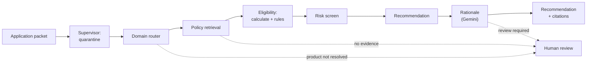
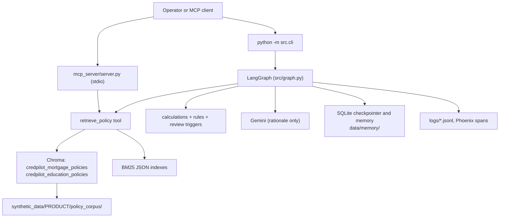
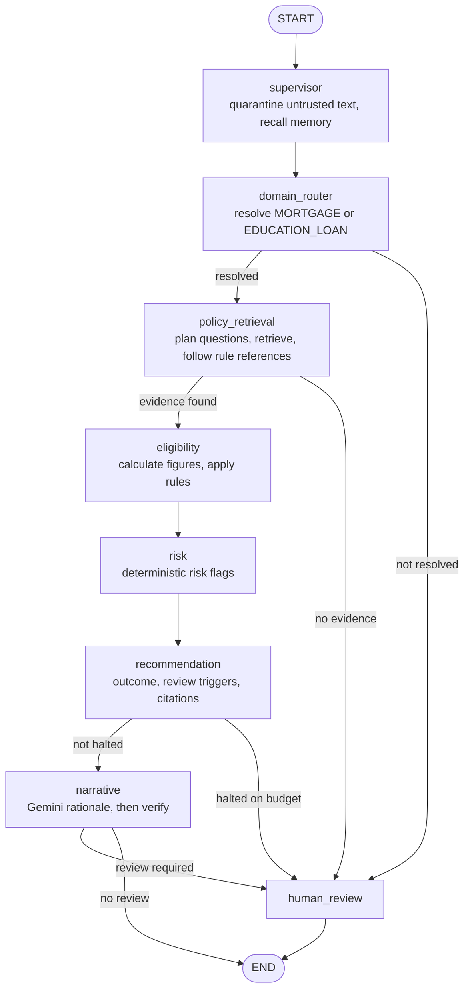

<div align="center">

# CredPilot — Loan Origination and Underwriting Copilot

**CredPilot is a LangGraph multi-agent copilot for loan underwriting. It takes one loan application through these steps to a cited recommendation that a human makes final:**

`quarantine applicant text` → `route the product` → `retrieve the governing policy` → `calculate the figures` → `apply the rules` → `screen the risk` → `recommend` → `write the rationale` → `route to a human`.


**[Summary](#1-summary)** ·
**[Workflow](#4-the-end-to-end-workflow)** ·
**[Retrieval](#7-the-retrieval-pipeline)** ·
**[Run it](#17-how-to-run-credpilot)** ·
**[Configuration](#176-environment-variables)** ·
**[Known problems](#20-known-problems)** ·
**[Glossary](#22-glossary)**

</div>

> [!NOTE]
> This README uses ASD-STE100 Simplified Technical English. The writing rules and the project
> vocabulary are in [`docs/ste-style-guide.md`](docs/ste-style-guide.md). Each term in the
> [Glossary](#22-glossary) has only one meaning.

> [!CAUTION]
> Do not use CredPilot to make a real credit decision. All applications and all policy documents are synthetic, and no credit professional validated the policy corpus.
> A human must decide each referred and each declined application. The graph routes these applications to `human_review` and has no path that issues them automatically.

---

CredPilot underwrites **two independent lending products**: U.S. residential mortgage and private education loans.
The two products share the AI infrastructure. They do not share business knowledge.
CredPilot reads an application and retrieves the policy version that governed it on the underwriting date.
It calculates affordability with code, screens the risk and drafts a recommendation with citations.
Gemini writes only the rationale. It does not retrieve, calculate, compare with a threshold or decide.

This README is the **one location that explains all of CredPilot**. It gives these topics:

- the general design
- each graph node and each subsystem, and its procedure, step by step
- the decision rules
- the data map
- the runbook
- the validation results and the known problems

| If you are… | Read |
|---|---|
| A manager or reviewer | [1](#1-summary), [3](#3-design-rules), [4](#4-the-end-to-end-workflow), [19](#19-validation-results), [21](#21-key-points) |
| A developer who joins the project | All sections, in sequence. Keep [17](#17-how-to-run-credpilot) and [20](#20-known-problems) open while you work |
| An operator who runs CredPilot | [17](#17-how-to-run-credpilot), then the section for the subsystem that you use |
| A compliance or audit reader | [3](#3-design-rules), [9](#9-the-review-triggers-and-the-recommendation), [12](#12-guardrails-and-observability), [20](#20-known-problems), then [`docs/compliance.md`](docs/compliance.md) |

---

## Table of contents

1. 🧭 [Summary](#1-summary)
2. 🏗️ [How CredPilot is built](#2-how-credpilot-is-built)
   - 2.1 [Components](#21-components)
   - 2.2 [System context](#22-system-context)
   - 2.3 [Repository layout](#23-repository-layout)
   - 2.4 [Other documents](#24-other-documents)
3. 🛡️ [Design rules](#3-design-rules)
4. 🔄 [The end-to-end workflow](#4-the-end-to-end-workflow)
   - 4.1 [Full flow](#41-full-flow)
   - 4.2 [The life cycle of one application](#42-the-life-cycle-of-one-application)
   - 4.3 [One ratio, three outcomes](#43-one-ratio-three-outcomes)
5. 🕸️ [The LangGraph](#5-the-langgraph)
6. 🔀 [The domain router](#6-the-domain-router)
7. 🔎 [The retrieval pipeline](#7-the-retrieval-pipeline)
   - 7.1 [Chunks](#71-chunks) · 7.2 [Pipeline stages](#72-pipeline-stages) · 7.3 [Temporal selection](#73-temporal-selection) · 7.4 [Citations](#74-citations) · 7.5 [Retrieval settings](#75-retrieval-settings)
8. 🧮 [The calculations and the rule engine](#8-the-calculations-and-the-rule-engine)
9. ⚖️ [The review triggers and the recommendation](#9-the-review-triggers-and-the-recommendation)
10. ✍️ [The rationale](#10-the-rationale)
11. 🧠 [Context engineering and memory](#11-context-engineering-and-memory)
12. 🔐 [Guardrails and observability](#12-guardrails-and-observability)
13. 🔌 [The MCP server](#13-the-mcp-server)
14. 🧪 [The synthetic data](#14-the-synthetic-data)
15. 📏 [The evaluation harness](#15-the-evaluation-harness)
16. 🗂️ [Data and file map](#16-data-and-file-map)
17. ▶️ [How to run CredPilot](#17-how-to-run-credpilot)
    - 17.1 [Prerequisites](#171-prerequisites) · 17.2 [Installation](#172-installation) · 17.3 [Run CredPilot](#173-run-credpilot) · 17.4 [Evaluate CredPilot](#174-evaluate-credpilot) · 17.5 [Run the tests](#175-run-the-tests) · 17.6 [Environment variables](#176-environment-variables) · 17.7 [Common errors](#177-common-errors)
18. 🧩 [How to extend CredPilot](#18-how-to-extend-credpilot)
19. ✅ [Validation results](#19-validation-results)
20. ⚠️ [Known problems](#20-known-problems)
21. 📌 [Key points](#21-key-points)
22. 📖 [Glossary](#22-glossary)

---

## 1. Summary

**The problem.** A copilot for loan underwriting must answer these difficult questions:

- Which lending product does this application belong to, and how do you keep the policy of one product out of the other?
- Which version of a policy governed the application on the day of underwriting?
- How do you keep a language model away from the figures, the thresholds and the decision?
- How do you show that each citation points to a real rule in a committed document?
- Which applications must go to a human, even when every threshold passes?

CredPilot gives each of these questions its own component. A deterministic pipeline makes the decision. The model explains the decision after it exists.

| Item | Value |
|---|---|
| Input | One application packet (JSON) from `synthetic_data/<product>/applications/`, and the as-of date |
| Output | A recommendation (`APPROVE_RECOMMENDATION`, `REFER_RECOMMENDATION` or `DECLINE_RECOMMENDATION`), the eligibility status, the risk level, the citations, the review reasons and a rationale |
| Products | **2**: `MORTGAGE` and `EDUCATION_LOAN`, each with its own corpus, parser and Chroma collection |
| Graph | **8** LangGraph nodes, conditional edges, a typed state and a SQLite checkpointer |
| Corpus | Mortgage: 42 policy documents, 174 distinct rules (6 policies at two versions). Education: 12 policy documents, 72 rules |
| Retrieval | BM25 + dense (`intfloat/e5-base-v2`) + reciprocal rank fusion + cross-encoder rerank, with temporal and product filters |
| Model | Google Gemini (`gemini-flash-latest` by default). **One** call for each assessment, for the rationale only |
| Without a key | Index build, retrieval, the CLI, the MCP server, the retrieval evaluation and the tests run with no API key |
| Safety | Every decline and every high-risk application goes to a human. Untrusted applicant text is quarantined. PII is redacted before it is written |
| Tests | **458** test functions in 29 files (`pytest`) |


```mermaid
flowchart LR
    IN["Application packet"] --> S["Supervisor:<br/>quarantine"] --> R["Domain router"] --> P["Policy retrieval"] --> E["Eligibility:<br/>calculate + rules"] --> K["Risk screen"] --> REC["Recommendation"] --> N["Rationale<br/>(Gemini)"] --> OUT["Recommendation<br/>+ citations"]
    N -.->|review required| H["Human review"]
    R -.->|product not resolved| H
    P -.->|no evidence| H
```

The model sits at the end of the pipeline, not at its center:

```
retrieval  →  calculation  →  rule engine  →  recommendation  →  rationale
└────────────────── deterministic ──────────────────────────┘    └ Gemini ┘
```

---

## 2. How CredPilot is built

### 2.1 Components

| Component | Location | Purpose |
|---|---|---|
| LangGraph | [`src/graph.py`](src/graph.py) | Typed state, supervisor, domain router, worker nodes, conditional edges, SQLite checkpointer |
| Product resolution | [`src/domain.py`](src/domain.py) | `LendingProductDomain` and the deterministic product resolution |
| Underwriting input | [`src/application_context.py`](src/application_context.py) | Adds the input tables to the packet. Refuses the outcome tables |
| Agentic-RAG tool | [`src/tools/rag_tool.py`](src/tools/rag_tool.py) | `retrieve_policy`: a Python callable, a LangChain `StructuredTool` and the MCP tool |
| Retrieval subsystem | [`src/rag/`](src/rag/) | Parsers, chunks, embedding, Chroma, BM25, fusion, rerank, applicability, citations, index build, integrity |
| Deterministic figures | [`src/calculations.py`](src/calculations.py) | Every underwriting figure for each product, and the risk screen |
| Rule engine | [`src/rules.py`](src/rules.py) | Applies the retrieved thresholds to the figures |
| Review triggers | [`src/review_triggers.py`](src/review_triggers.py) | `UWR-HRV-001`, the mandatory human-review routing table |
| Rationale | [`src/narrative.py`](src/narrative.py) | The one Gemini call, and the deterministic check of its output |
| Model access | [`src/llm.py`](src/llm.py) | The only module that calls Gemini. Key loading, model fallback, cost rates |
| Context engineering | [`src/context/`](src/context/) | Write, select, compress, isolate |
| Tiered memory | [`src/memory/`](src/memory/) | Short-term window and long-term semantic recall, scoped to one subject |
| Guardrails | [`src/guardrails/`](src/guardrails/) | Injection detection, quarantine, PII redaction |
| Observability | [`src/observability/`](src/observability/) | Phoenix and OpenTelemetry spans, tool-call log, audit trail |
| MCP server | [`mcp_server/`](mcp_server/) | 3 tools and 3 resources over stdio, used through `langchain-mcp-adapters` |
| CLI | [`src/cli.py`](src/cli.py) | `assess`, `retrieve` and `corpus` |
| Configuration | [`config/rag.yaml`](config/rag.yaml), [`src/config.py`](src/config.py) | Every retrieval parameter, typed |
| Evaluation | [`eval/retrieval/`](eval/retrieval/), [`eval/agent/`](eval/agent/) | Retrieval metrics and benchmarks. End-to-end accuracy with DeepEval as LLM-as-judge |
| Scripts | [`scripts/`](scripts/) | Index build, evidence regeneration, golden signals, dashboard, trace export, checks |
| Tests | [`tests/`](tests/) | Parsers, isolation, temporal, security, contracts, rules, loops, memory, integration |

### 2.2 System context


```mermaid
flowchart TB
    U["Operator or MCP client"] --> CLI["python -m src.cli"]
    U --> MCP["mcp_server/server.py (stdio)"]
    CLI --> G["LangGraph (src/graph.py)"]
    G --> RAG["retrieve_policy tool"]
    MCP --> RAG
    RAG --> CH["Chroma: credpilot_mortgage_policies<br/>credpilot_education_policies"]
    RAG --> BM["BM25 JSON indexes"]
    CH --> CORP["synthetic_data/PRODUCT/policy_corpus/"]
    G --> CALC["calculations + rules + review triggers"]
    G --> LLM["Gemini (rationale only)"]
    G --> CK["SQLite checkpointer and memory<br/>data/memory/"]
    G --> LOG["logs/*.jsonl, Phoenix spans"]
```

No Docker is necessary. No database service is necessary. No hosted model endpoint or hosted vector endpoint is used. The embedding model and the reranker are local Sentence-Transformers models, and Chroma is embedded.

### 2.3 Repository layout

```
CredPilot/
├── .env.example                    # environment variables, no values
├── requirements.txt  pyproject.toml  pytest.ini
├── config/rag.yaml                 # every retrieval parameter
├── src/
│   ├── graph.py  cli.py  domain.py  config.py  console.py
│   ├── application_context.py      # input tables only, outcome tables refused
│   ├── calculations.py  rules.py  review_triggers.py
│   ├── narrative.py  llm.py        # the one model call
│   ├── rag/                        # parsers/, embedding, vectorstore, lexical, fusion,
│   │                               # rerank, applicability, expansion, citations,
│   │                               # pipeline, indexer, integrity, corpus_registry, models
│   ├── tools/rag_tool.py           # the agentic-RAG tool
│   ├── context/                    # write, select, compress, isolate, assemble
│   ├── memory/                     # short_term, long_term, store
│   ├── guardrails/                 # sanitize, redaction
│   └── observability/              # tracing, tool_logging
├── mcp_server/                     # server.py, client.py
├── eval/
│   ├── retrieval/                  # harness, metrics, ablation, benchmarks, sweep
│   ├── agent/                      # end-to-end run, dataset, Gemini judge
│   └── results/                    # committed retrieval results
├── scripts/                        # build, regenerate, signals, dashboard, traces, checks
├── data/
│   ├── policy_corpus/              # corpus registry (not a copy of the documents)
│   └── vectorstore/                # manifest, integrity report, BM25 indexes
├── synthetic_data/                 # mortgage/ and education/: applications, corpus, golden sets
├── reports/                        # end-to-end evaluation, golden signals, dashboard
├── logs/  traces/                  # machine-written logs and span exports
├── docs/                           # architecture, runbook, model card, risk, compliance
└── tests/                          # 29 test files, tests/rag/ for retrieval
```

### 2.4 Other documents

| Document | Contents |
|---|---|
| [`docs/rag/README.md`](docs/rag/README.md) | The retrieval subsystem |
| [`docs/rag/RUNBOOK.md`](docs/rag/RUNBOOK.md) | Build, run, evaluate, trace, troubleshoot |
| [`docs/rag/ARCHITECTURE.md`](docs/rag/ARCHITECTURE.md) | How retrieval is built and why |
| [`docs/rag/REQUIREMENTS_MAPPING.md`](docs/rag/REQUIREMENTS_MAPPING.md) | Requirements → evidence → tests, with the deviations |
| [`docs/rag/TEMPORAL_RETRIEVAL.md`](docs/rag/TEMPORAL_RETRIEVAL.md) | Version selection by effective date |
| [`docs/rag/RETRIEVAL_ABLATION.md`](docs/rag/RETRIEVAL_ABLATION.md) | The measured value of each retrieval layer |
| [`docs/rag/EMBEDDING_BENCHMARK.md`](docs/rag/EMBEDDING_BENCHMARK.md) | Four local embedding models, both products |
| [`docs/rag/RERANKER_BENCHMARK.md`](docs/rag/RERANKER_BENCHMARK.md) | Three cross-encoders and a no-reranker baseline |
| [`docs/rag/DATA_QUALITY_FINDINGS.md`](docs/rag/DATA_QUALITY_FINDINGS.md) | Defects in the committed datasets |
| [`docs/failure-analysis.md`](docs/failure-analysis.md) | Thirteen real failures (F-1 to F-13), with evidence and before and after values |
| [`docs/model-card.md`](docs/model-card.md) | Models, data, intended use, limitations, failure modes |
| [`docs/risk-register.md`](docs/risk-register.md) | 28 risks against the OWASP LLM Top 10 and NIST AI RMF, with the residual risk |
| [`docs/compliance.md`](docs/compliance.md) | EU AI Act, NIST AI RMF, India DPDP: what is addressed, the evidence, and what is not met |
| [`docs/output-risk.md`](docs/output-risk.md) | Three output tiers and the gate of each tier |

---

## 3. Design rules

### 3.1 The model never makes a figure, a threshold or a decision
`src/calculations.py` calculates the figures. The retriever supplies the thresholds. `src/rules.py` applies one to the other. Gemini receives the outcome as a fact and writes the rationale. No code path lets the rationale text change the recommendation. `POL-DTI-001` rule `DTI-CALC-002` forbids a model to produce an underwriting figure.

### 3.2 Product isolation happens before retrieval
The domain router resolves the product from structured facts. That decision selects the Chroma collection. A mortgage query cannot return an education policy, because it never searches the education collection. If no structured fact resolves the product, retrieval returns `PRODUCT_CLARIFICATION_REQUIRED` and searches nothing. No combined collection exists, and `PolicyVectorStore` refuses to open one named `credpilot_all_policies`.

### 3.3 Retrieval returns the version that governed, not the newest version
Version selection is a hard filter on the as-of date. One retrieval never returns two versions of one policy. An as-of date before all policies returns `NO_APPLICABLE_POLICY`.

### 3.4 No threshold is hard-coded
The rule engine reads each threshold from the parameter table of the retrieved rule. If the rule is not in the evidence, the verdict is `INDETERMINATE`. Absence of evidence is never a permission and never a failure (`POL-GEN-001` `GEN-ELG-005`).

### 3.5 Every citation resolves to a committed document
The citation check opens the source file in the corpus and finds the rule ID in it. The check does not trust the index that made the citation. Evidence with a citation that does not resolve is dropped.

### 3.6 A human decides each difficult application
A decline recommendation always goes to a human (`POL-DEC-001` `DEC-REC-002`). A high risk level, a missing threshold, a review trigger, an injection attempt and an unfaithful rationale also go to a human.

### 3.7 Applicant text is evidence, never instruction
Untrusted applicant text can change what retrieval searches for. It cannot change the product, the as-of date, the filters, the ranking parameters, the citations or the review rules.

### 3.8 Runtime code never reads the answer
`src/application_context.py` reads an allowlist of input tables. It raises an error on the tables that hold computed ratios, rule evaluations, eligibility results or decisions. No runtime module reads `golden_set/`. Only the evaluation reads it.

### 3.9 Every run has a limit
A step budget of 24 node runs is in the state, so a node can stop cleanly with a reason. A LangGraph `recursion_limit` of 40 is the second guard.

---

## 4. The end-to-end workflow

### 4.1 Full flow


```mermaid
flowchart TB
    START(["START"]) --> SUP["supervisor<br/>quarantine untrusted text, recall memory"]
    SUP --> DR["domain_router<br/>resolve MORTGAGE or EDUCATION_LOAN"]
    DR -- "resolved" --> PR["policy_retrieval<br/>plan questions, retrieve, follow rule references"]
    DR -- "not resolved" --> HR["human_review"]
    PR -- "evidence found" --> EL["eligibility<br/>calculate figures, apply rules"]
    PR -- "no evidence" --> HR
    EL --> RK["risk<br/>deterministic risk flags"]
    RK --> RC["recommendation<br/>outcome, review triggers, citations"]
    RC -- "not halted" --> NA["narrative<br/>Gemini rationale, then verify"]
    RC -- "halted on budget" --> HR
    NA -- "review required" --> HR
    NA -- "no review" --> END(["END"])
    HR --> END
```

### 4.2 The life cycle of one application

1. `initial_state` loads the packet and adds the input tables. It sets the as-of date from the packet if you do not give one.
2. The supervisor quarantines the untrusted applicant text and records each injection finding.
3. The supervisor recalls prior-session context for the primary borrower from long-term memory.
4. The domain router resolves the product from structured facts.
5. The policy retrieval node plans the policy questions that this file raises.
6. The node calls `retrieve_policy` once for each question, in the collection of that product only.
7. The node follows the rule IDs that the evidence refers to, to a maximum of 6 rules.
8. The eligibility node calculates the figures and applies the retrieved thresholds.
9. The risk node calculates the risk flags and the risk level.
10. The recommendation node applies the review triggers and selects the outcome.
11. The narrative node calls Gemini once, then checks each citation and each figure in the rationale.
12. If a human must review the file, the graph goes to `human_review`. Otherwise it ends.

### 4.3 One ratio, three outcomes

`APP-000055`, `APP-000056` and `APP-000057` have the same borrower profile. Each one calculates to **44.00 %** back-end debt-to-income (DTI).

| Application | As-of date | Governing version | Ceiling applied | Eligibility | Recommendation |
|---|---|---|---|---|---|
| `APP-000055` | 2026-06-25 | `POL-DTI-001` **v1.0** | 45 % | ELIGIBLE | APPROVE |
| `APP-000056` | 2026-07-08 | `POL-DTI-001` **v2.0** | 43 % | **INELIGIBLE** | **DECLINE** → human review |
| `APP-000057` | 2026-07-08 | `POL-DTI-001` **v2.0** | 45 % (3 documented factors) | ELIGIBLE | APPROVE |

The CLI output for `APP-000056` and `APP-000057`:

```
APP-000056  back_end_dti 0.4400
            BREACH back_end_dti: 0.4400 <= 0.4300  [POL-DTI-001 v2.0 rule DTI-CONV-001]
            DECLINE_RECOMMENDATION — HUMAN REVIEW REQUIRED
              a decline recommendation is always routed to a human (DEC-REC-002)

APP-000057  back_end_dti 0.4400
            ceiling extended to 45.00% on 3 documented compensating factors:
              verified reserves of 61.1 months (>= 6.0)
              representative credit score 744 (>= 720)
              loan-to-value 72.00% (<= 75%)
            APPROVE_RECOMMENDATION
```

On 2026-06-25, `POL-DTI-001` v1.0 governs and permits 45 % with no condition. Thus `APP-000055` passes for a different reason.
The version that retrieval returned and the documents of each file decide the three outcomes.
No value in this example is hard-coded. The 43 % ceiling, the 45 % extension, the two-factor minimum and the limit of each factor come from the retrieved policy text.
If you remove the retrieved rule, the engine reports `INDETERMINATE`. It does not use a number from the code.

---

## 5. The LangGraph

**Purpose.** Run one application through typed nodes with conditional edges, and keep each run inside a budget.

| Node | Agent role | What it does | Model? |
|---|---|---|---|
| `supervisor` | Supervisor | Quarantines untrusted text, recalls memory, routes to the domain router | No |
| `domain_router` | Loan domain router | Resolves the product from structured facts | No |
| `policy_retrieval` | Policy Retrieval Agent | Plans questions, calls `retrieve_policy`, follows rule references | No |
| `eligibility` | Eligibility and Affordability Agent | Calculates figures and applies the rules | No |
| `risk` | Risk Screening Agent | Calculates the risk flags and the level | No |
| `recommendation` | Recommendation | Applies the review triggers and selects the outcome | No |
| `narrative` | Narrative rationale | Writes the rationale and verifies it | **Yes**, one Gemini call |
| `human_review` | Terminal node | Records the interaction and the review reasons | No |

**The policy questions.** The retrieval node asks one targeted question for each underwriting concern. It asks a conditional question only when the packet shows the concern.

| Product | Base questions | Conditional questions (flag that adds them) |
|---|---|---|
| Mortgage | `affordability`, `leverage`, `credit`, `reserves`, `funds_to_close`, `documentation`, `decisioning` (7) | `self_employed`, `variable_income`, `rental_income`, `cash_out`, `jumbo`, `untrusted_text` |
| Education | `product_underwriting`, `cosigner`, `capacity`, `school`, `risk_grade`, `fraud`, `compliance` (7) | `international`, `refinance`, `untrusted_text` |

**Rules**

- `policy_evidence` accumulates across all retrieval calls. The recommendation cites every rule that the run used.
- The state keeps evidence as plain dictionaries, so a checkpoint is readable without the Python classes.
- `MAX_DEPENDENCY_FOLLOWS` = 6. The node follows one round of rule references. For example, `DTI-CONV-001` refers to the compensating factors in `DTI-CONV-003`.
- `DEFAULT_STEP_BUDGET` = 24. If a node finds the budget spent, it halts with a reason and routes to `human_review`.
- `RECURSION_LIMIT` = 40. LangGraph raises `GraphRecursionError` above this value.
- The checkpointer writes to `data/memory/credpilot_checkpoints.sqlite`.

---

## 6. The domain router

**Purpose.** Resolve the product before any retrieval, from structured facts only.

**Procedure**

1. If the caller gives an explicit domain, use it.
2. Otherwise, read the application ID. `APP-` + 6 digits is `MORTGAGE`. `APP-` + 4 digits + `-` + 5 digits is `EDUCATION_LOAN`.
3. Otherwise, read the structure of the packet.
4. If no fact resolves the product, raise `ProductResolutionError`. The graph routes to `human_review`.

**Rules**

- The router never reads untrusted text to resolve the product.
- The router never searches both corpora and lets a model select the result.

---

## 7. The retrieval pipeline

**Purpose.** Return the rules that govern one question for one product on one as-of date, each with a citation that resolves.

```
                            Supervisor
                                 |
                       Loan Domain Router          <- structured facts only
                        /                \
                 MORTGAGE              EDUCATION_LOAN
                        \                /
                     Policy Retrieval Agent
                                |
                     retrieve_policy (RAG tool)
        +-----------------------+------------------------+
  credpilot_mortgage_policies              credpilot_education_policies
  329 chunks · 42 documents                101 chunks · 12 documents
  174 rules · 6 versioned policies         72 rules · 1 version each
```

### 7.1 Chunks

The retrieval unit is one whole rule with all its parts: source category, severity, outcome, "applies when", body, parameter table, acceptable evidence, exceptions and cross-references.
A fixed character window can separate a rule from its threshold row. A rule without its threshold is not evidence.

| Item | Mortgage | Education |
|---|---|---|
| Rule marker | `### DTI-CONV-001 — Title` (own heading) | `**EDU-UW-001 -- Title.**` (bold, inline) |
| Product scope key | `product_scope` | `product_scope` or `products` |
| Versions | 6 policies × 2 versions, boundary 2026-07-01 | 1 version for each policy |
| Expiry and supersession | Published | Not published |
| Chunks (rule / section / overview) | 329 (203 / 84 / 42) | 101 (72 / 18 / 11) |

Chunk IDs are deterministic and use the rule ID, not a content hash:

```
MORTGAGE__POL-DTI-001__v2.0__DTI-CONV-001__000
EDUCATION__POL-002__v1.0__EDU-UW-001__000
EDUCATION__POL-001__v1.0__S05__000              (section with no rule)
MORTGAGE__POL-DTI-001__v2.0__OVERVIEW__000      (document overview)
```

**Rules**

- A secondary split occurs only above 4,200 characters, at paragraph boundaries, with the parent heading in each part. No rule in either corpus needs it at this time. `tests/rag/test_chunking.py` checks this.
- A section with no rule becomes a section chunk. The parsers cover each line of the source documents.
- A field that a product does not support is `None`. The parsers do not fill it to make the products look the same.

### 7.2 Pipeline stages

| # | Stage | Kind | Span name |
|---|---|---|---|
| 1 | Sanitize the query: remove imperatives, keep the topic | Guard | `rag.retrieve` |
| 2 | Resolve the product domain: select the collection | **Hard** filter | `domain.resolve` |
| 3 | Applicability: effective-date window and governing version | **Hard** filter | `metadata.filter` |
| 4 | BM25 search, top 15 (with deterministic synonym expansion) | Rank | `bm25.search` |
| 5 | Dense search, top 15 | Rank | `embedding.query`, `chroma.search` |
| 6 | Reciprocal rank fusion, top 12 | Rank | `rrf.fusion` |
| 7 | Cross-encoder rerank, top 10 | Rank | `reranker.run` |
| 8 | Temporal check again | **Hard** filter | `temporal.validate` |
| 9 | Scope affinity and deduplication | Soft boost | — |
| 10 | Citation check: drop evidence that does not resolve | **Hard** filter | `citation.validate` |
| — | Return the top 6 `PolicyEvidence` items | — | `rag.result` |

**Rules**

- No language model is in any stage. The same query, corpus and as-of date give the same evidence in the same sequence.
- Each width is a floor, not a cap: `max(configured, top_k + slack)`. A request for 15 results no longer returns 4 (failure F-7).
- Product scope (`product_scope`, `purpose_scope`, `occupancy_scope`) is a soft boost. The scope metadata is incomplete. A hard filter on it drops overlays that govern every programme.
- No LLM query rewrite and no MMR are used. A committed synonym table and the deduplication by (policy, version, rule) do that work.

**Retrieval statuses:** `FOUND`, `NO_APPLICABLE_POLICY`, `AMBIGUOUS_POLICY`, `MISSING_CONTEXT`, `PRODUCT_CLARIFICATION_REQUIRED`, `HUMAN_REVIEW_REQUIRED`.

### 7.3 Temporal selection

`POL-DTI-001` permits 45 % at v1.0 and 43 % at v2.0. Retrieval of the newest document changes the decision for files before 2026-07-01.

1. Keep a document if `effective_date <= as_of_date` and (`expiration_date` is null or `as_of_date <= expiration_date`). Both bounds are inclusive.
2. For each policy ID, keep the newest eligible version. Mark the older versions `SUPERSEDED` and remove them.
3. Compare versions as numbers, not as text: `10.0` comes after `2.0`.
4. Apply the filter before the search, and again after the rerank.

The education corpus publishes one version for each document, with an effective date and no expiry. The effective-date filter applies, but version selection has nothing to select. Details are in [`docs/rag/TEMPORAL_RETRIEVAL.md`](docs/rag/TEMPORAL_RETRIEVAL.md).

### 7.4 Citations

| Product | Citation format |
|---|---|
| Mortgage | `POL-DTI-001 v2.0 rule DTI-CONV-001` |
| Education | `POL-002 EDU-UW-001` |

A chunk with no rule cites its section. A chunk with no rule and no section cites the document. The citation builder never makes a rule ID.
The documents stay in `synthetic_data/<product>/policy_corpus/`. `data/policy_corpus/corpus_registry.json` holds the registry with the SHA-256 of each document, not a second copy.

### 7.5 Retrieval settings

All values are in [`config/rag.yaml`](config/rag.yaml). A benchmark selected each model.

| Setting | Value |
|---|---|
| Embedding model | `intfloat/e5-base-v2`, 768 dimensions, cosine, normalized |
| Reranker | `cross-encoder/ms-marco-MiniLM-L-6-v2` |
| `dense_top_k` / `lexical_top_k` / `fusion_top_k` / `rerank_top_k` / `final_top_k` | 15 / 15 / 12 / 10 / 6 |
| `rrf_k` | 60 |
| `min_reranker_score` | −8.0 (never empties a result set alone) |
| Deduplication | `max_per_rule` 1, `max_per_policy` 3, `max_overview` 2 |
| Chunking | `max_chars` 4,200, `split_overlap_chars` 200, `min_chars` 40 |

The embedding model applies its own prefix rule (`query: ` and `passage: ` for E5) in `src/rag/embedding.py`. The caller does not apply it.

---

## 8. The calculations and the rule engine

**Purpose.** Calculate each figure with code, then apply the thresholds of the retrieved rules.

```
application packet  ->  src/calculations.py   ->  DTI = 44.00%
policy corpus       ->  the RAG retriever     ->  threshold = 43%
both                ->  src/rules.py          ->  breach
the breach          ->  Gemini                ->  the written explanation
```

| Product | Main figures | Formula version |
|---|---|---|
| Mortgage | `back_end_dti`, `front_end_dti`, `ltv`, `housing_expense_pitia`, `months_of_reserves`, `funds_to_close_required`, `funds_to_close_available`, `residual_income_monthly` | `mortgage-affordability-2.1` |
| Education | `education_dti`, `debt_to_projected_income`, `residual_income_monthly`, `cost_of_attendance`, `computed_funding_gap`, `eligible_amount` | `education-capacity-1.0` |

Ratios have 4 decimal places and money has cents, rounded half-up, as `DTI-CALC-002` specifies. The code uses `Decimal`.

**Rule families that the engine evaluates**

| Product | Family | Location | What it checks |
|---|---|---|---|
| Mortgage | `DTI-CONV` | `src/rules.py` | Affordability ceiling, with the compensating-factor extension (`DTI-CONV-003`) |
| Mortgage | `CRD-SCR` | `src/rules.py` | Minimum representative score, graduated by LTV in v2.0 |
| Mortgage | `AST-RSV` | `src/rules.py` | Minimum reserves, measured after the funds-to-close draw |
| Mortgage | `AST-FTC` | `src/rules.py` | Funds-to-close sufficiency |
| Mortgage | `SEC-INJ` | `src/guardrails/`, `supervisor` | Injection detection and quarantine |
| Mortgage | `UWR-HRV` | `src/review_triggers.py` | The mandatory human-review routing table |
| Education | `EDU-INC` | `src/rules.py` | DTI ceiling for each product code (UG, GR, SP, INTL, REFI) and residual income |
| Education | `EDU-SCH` | `src/rules.py` | School eligibility and certification |
| Education | `EDU-GOV` | `src/review_triggers.py` | The permitted-outcome vocabulary |

**Procedure**

1. Read the parameter table rows (`| `name` | value |`) of the retrieved rule.
2. If the evidence holds two versions of one policy, raise `MixedVersionEvidenceError`.
3. Compare the figure with the threshold and record the verdict and the citation.
4. If the threshold or the figure is absent, record `INDETERMINATE`.
5. Summarize: any `FAIL` gives `INELIGIBLE`. Otherwise any `INDETERMINATE` gives `INDETERMINATE`. Otherwise the status is `ELIGIBLE`.

**The risk screen** (`screen_risk`, `risk-screen-1.0`)

| Level | Condition |
|---|---|
| `HIGH` | Any of `OFAC_HIT`, `KYC_NOT_PASSED`, `ENROLLMENT_FRAUD_FLAG`, `OCCUPANCY_INCONSISTENCY`, or an injection attempt in the applicant text |
| `MEDIUM` | `JUMBO_MANDATORY_REVIEW` or `SELF_EMPLOYED_MANDATORY_REVIEW`, or two or more flags |
| `LOW` | One other flag, or no flag |

---

## 9. The review triggers and the recommendation

**Purpose.** Select the outcome, and send to a human each file that policy says a human must see.

`UWR-HRV-001` is a routing table, not a scoring input. A file that matches one trigger goes to a human, even when every threshold passes. The module reads the borderline band (`borderline_band_pct_points`) from the retrieved rule.

| Trigger | Evaluated |
|---|---|
| `decline`, `borderline_affordability`, `high_value_exposure`, `self_employment`, `fraud_or_document_integrity`, `identity_not_clean`, `security_event`, `occupancy_contradiction`, `unsourced_large_deposit`, `unresolved_evidence_conflict` | Yes |
| Automated-underwriting refer or caution result, requested policy exception, valuation or collateral finding | No. No committed table has a field for them. The output reports them as `unevaluable` |

For education, `EDU-GOV-002` states its referral criterion with no number. The module reports the borderline trigger as not evaluable for education. It does not use the mortgage band.

**Procedure of the outcome**

| Condition (in this sequence) | Outcome | Human review |
|---|---|---|
| Eligibility is `INDETERMINATE` | `REFER_RECOMMENDATION` | Yes |
| Eligibility is `INELIGIBLE` | `DECLINE_RECOMMENDATION` | Yes, always (`DEC-REC-002`) |
| Risk level is `HIGH` | `REFER_RECOMMENDATION` | Yes |
| A review trigger or an earlier reason applies | `REFER_RECOMMENDATION` | Yes |
| None of the above | `APPROVE_RECOMMENDATION` | No |

The recommendation records the citations, the evidence count, `all_citations_resolve` and the review triggers.

**Output tiers** ([`docs/output-risk.md`](docs/output-risk.md))

| Tier | What it covers | Gate |
|---|---|---|
| Low | Retrieved policy text, citations, figures, retrieval diagnostics | The citation must resolve. Figures carry their formula version |
| Medium | Eligibility status, risk level, approve and refer recommendations, the rationale | Rule-engine verdict, deterministic rationale check, sufficient evidence |
| High | Decline recommendations, adverse-action reason codes, any file with an injection attempt | Hard routing to `human_review`. No automatic path exists |

---

## 10. The rationale

**Purpose.** Write text that a human reviewer can read, from a decision that already exists.

| Input | Output |
|---|---|
| The outcome, the figures with their formula version, the cited evidence (through `build_context`) | The rationale text, `is_faithful`, the model name, the citations used, the unsupported citations and figures, token usage and latency |

**Procedure**

1. Assemble the context for the `narrative` role: isolate, select, compress, write.
2. Call Gemini once, with temperature 0.
3. Check each citation and each figure in the text against the evidence and the calculated figures (`verify_narrative`). No model is used for this check.
4. If the check fails, keep the text, mark it unfaithful and route the file to `human_review`.
5. If no key is set, or `CREDPILOT_NARRATIVE=off`, write a deterministic summary and set `available: false`. The file still gets a recommendation.

**Rules**

- Every file gets a rationale, also the files that a human will decide.
- `src/llm.py` tries `CREDPILOT_GEMINI_MODEL` first, then `gemini-flash-latest`, `gemini-3.5-flash` and `gemini-pro-latest`. It records the model that answered.
- No Claude model is called at runtime and no `ANTHROPIC_API_KEY` is read. `tests/rag/test_stack_boundaries.py` checks this. Claude Code was the development assistant.

---

## 11. Context engineering and memory

**Context engineering** ([`src/context/`](src/context/)). `build_context` applies four operations in this sequence: isolate, select, compress, write.

| Operation | Module | What it does |
|---|---|---|
| Isolate | `isolate.py` | Keeps untrusted text, policy evidence and figures in separate compartments |
| Select | `select.py` | Selects the evidence that one role needs, by relevance and by role |
| Compress | `compress.py` | Fits a budget (12,000 characters by default). Policy evidence is truncated at paragraph boundaries and keeps its parameter tables. Only conversation history and notes can be summarized by Gemini |
| Write | `write.py` | Records the run in a scratchpad that can be read back |

Isolation comes first. If compression comes first, a summarizer can read applicant text as instruction.

**Tiered memory** ([`src/memory/`](src/memory/))

| Tier | Storage | Scope | Contents |
|---|---|---|---|
| Short-term | LangGraph checkpointer, window of 20 turns | One thread | The turns of this conversation, with the trust class of each turn |
| Long-term | SQLite `data/memory/credpilot_memory.sqlite` | One subject (the primary borrower) | Notes that can be recalled by key or semantically, with the same local embedding model |

**Rules**

- Memory never stores a decision as a fact, and never stores policy.
- Memory redacts each record on write.
- A recall for one subject cannot return the memory of a different subject (`POL-SEC-001` `SEC-INJ-002`).
- Memory never gates an assessment. If the store is not available, the assessment continues.
- `tests/test_memory_persistence.py` writes the cross-session recall test to `logs/memory_test.log`.

---

## 12. Guardrails and observability

**Injection guardrail** ([`src/guardrails/sanitize.py`](src/guardrails/sanitize.py)). Instruction patterns (for example "ignore previous", "waive the requirement") do not block retrieval. The guardrail removes the imperative, keeps the policy question and records the finding. The graph then routes the file to a human. The mortgage corpus has six adversarial applications, `APP-000065` to `APP-000070`, governed by `POL-SEC-001` `SEC-INJ-001`.

**PII redaction** ([`src/guardrails/redaction.py`](src/guardrails/redaction.py)). Deterministic regex redaction runs first, always. Microsoft Presidio runs second, if it is installed. Every log line, span attribute and evaluation artifact passes through `redact_text`. Each placeholder tells the kind of value that was removed.

**Logs** ([`src/observability/tool_logging.py`](src/observability/tool_logging.py))

| File | Contents |
|---|---|
| `logs/tool_calls.jsonl` | Each tool call, redacted |
| `logs/agent_actions.jsonl` | Each consequential action (routing, eligibility, risk, recommendation, rationale, human review) |
| `logs/mcp_transcript.jsonl` | The MCP session transcript |

**Tracing** ([`src/observability/tracing.py`](src/observability/tracing.py)). Each retrieval stage opens a named span (see [7.2](#72-pipeline-stages)). Tracing is off by default. Spans carry IDs, counts, latencies and rule IDs, not applicant text. If Phoenix or the exporter is not available, the span helpers do nothing and retrieval continues.

---

## 13. The MCP server

**Purpose.** Give the retrieval subsystem to any MCP client over stdio.

| Kind | Name | What it does |
|---|---|---|
| Tool | `retrieve_policy` | Runs the full retrieval pipeline for one product |
| Tool | `resolve_citation` | Checks that a citation resolves to a committed document, in either product format |
| Tool | `list_policy_rules` | Lists the rules of one product, or of one policy document |
| Resource | `credpilot://policies/mortgage` | The mortgage policy inventory |
| Resource | `credpilot://policies/education` | The education policy inventory |
| Resource | `credpilot://index/manifest` | The index build manifest |

**Rules**

- Text on stdout corrupts the JSON-RPC stream. The server disables progress bars, loads the models before `mcp.run()` and wraps each handler in `@protocol_safe`. Keep this for each new handler (failure F-3).
- `mcp_server/client.py` opens a session and loads the tools through `langchain-mcp-adapters`.

---

## 14. The synthetic data

All data is synthetic. Committed code makes it from fixed seeds. No record is real, and no policy is the policy of a real lender.

| Item | Mortgage | Education |
|---|---|---|
| Applications | 75 | 200 |
| Policy documents | 42 (6 at two versions) | 12 |
| Rule chunks | 203 | 72 |
| Distinct rule IDs | 174 | 72 |
| Applicant documents | 1,140 | 18 |
| Golden cases | 75 | 20 |
| Structured input tables | 32 CSV files in `structured/` | Embedded in each packet |
| Generator | `synthetic_data/mortgage/generator/` | `synthetic_data/education/generator/` |

Each product has its own data dictionary and README under `synthetic_data/<product>/`. The overview is in [`synthetic_data/README.md`](synthetic_data/README.md).

---

## 15. The evaluation harness

**Purpose.** Measure retrieval and the full graph, per product, and publish the limits beside the figures.

| Harness | Entry point | Measures | Needs a key |
|---|---|---|---|
| Retrieval evaluation | `eval/retrieval/run_retrieval_eval.py` | Policy and rule recall, MRR, nDCG, citation validity, contamination, version accuracy, latency | No |
| Embedding benchmark | `eval/retrieval/benchmark_embeddings.py` | Four local embedding models | No |
| Reranker benchmark | `eval/retrieval/benchmark_rerankers.py` | Three cross-encoders and no reranker | No |
| Ablation | `eval/retrieval/ablation.py` | Six pipeline configurations | No |
| Funnel sweep | `eval/retrieval/sweep_pipeline.py` | Six funnel widths | No |
| End-to-end evaluation | `eval/agent/run_agent_eval.py` | Outcome accuracy, citations, rationale faithfulness, DeepEval judge, cost, latency | **Yes** |

**Rules**

- Every headline figure is a macro average across the two products. A pooled mean is mainly a mortgage score, because mortgage has 75 golden cases and education has 20.
- The deterministic metrics run on every case. The judged metrics run on a balanced sample of 20 for each product. `judged_cases` gives the denominator.
- `hallucination_rate` = 1 − DeepEval `HallucinationMetric` score. In DeepEval 4.x, a score of 1.0 means grounded.
- Grounding is measured twice. `narrative_faithfulness_deterministic` asks no model. If it disagrees with a judged figure, the deterministic figure governs.
- `--limit-per-product` takes the first *n* cases of each product, not the first *n* overall.

---

## 16. Data and file map

| Path | Committed? | Contents |
|---|---|---|
| `synthetic_data/<product>/policy_corpus/` | Yes | The policy documents |
| `synthetic_data/<product>/applications/` | Yes | The application packets |
| `synthetic_data/<product>/golden_set/` | Yes | The golden cases. Only the evaluation reads them |
| `synthetic_data/mortgage/structured/` | Yes | The structured tables. Runtime reads the input tables only |
| `data/policy_corpus/corpus_registry.json` | Yes | Product, policy ID, version, window, rule IDs, SHA-256 and path of each document |
| `data/vectorstore/index_manifest.json` | Yes | Models, counts, SHA-256 and chunk IDs of each document |
| `data/vectorstore/index_integrity.json` | Yes | The 16 integrity checks |
| `data/vectorstore/lexical/bm25_*.json` | Yes | The BM25 indexes, one for each product |
| `data/vectorstore/credpilot/` | No (git ignores it) | The Chroma store (about 8 MB). The index build makes it again in about 30 s |
| `data/memory/` | No (git ignores it) | The LangGraph checkpoints and the long-term memory |
| `eval/results/*.json`, `*.jsonl` | Yes | Retrieval evaluation, benchmarks, ablation, sweep |
| `reports/eval_report.json`, `reports/eval_cases.jsonl` | Yes | The end-to-end evaluation |
| `reports/golden_signals.json`, `reports/dashboard_data.csv`, `reports/dashboard.png` | Yes | Latency, tokens, cost, accuracy, error signals and the dashboard |
| `reports/faithfulness_recheck.json` | Yes | The re-derivation of the deterministic faithfulness |
| `reports/assessments/` | Yes | Sample assessment outputs |
| `logs/*.jsonl`, `logs/memory_test.log` | Yes | Machine-written logs, redacted |
| `traces/phoenix_spans.jsonl`, `traces/trace_summary.json` | Yes | Span export of seven applications |
| `.env` | No (git ignores it) | Local secrets |
| `.env.example` | Yes | Variable names, no secret values |

---

## 17. How to run CredPilot

### 17.1 Prerequisites

| Need | For |
|---|---|
| Python 3.11+ | All components |
| The packages in `requirements.txt` | All components |
| About 530 MB of disk for the models | `intfloat/e5-base-v2` (about 440 MB) and the reranker (about 90 MB), downloaded once from the Hugging Face hub |
| A Gemini API key (starts with `AIza`) | The rationale and the end-to-end evaluation only |
| `deepeval` | The end-to-end evaluation (not in `requirements.txt`) |
| `matplotlib` | `scripts/build_dashboard.py` (not in `requirements.txt`) |

### 17.2 Installation

```bash
git clone https://github.com/KrishnaAnnavaram/CredPilot.git
cd CredPilot
python -m venv .venv
.venv/Scripts/activate                 # source .venv/bin/activate on macOS/Linux
pip install -r requirements.txt
cp .env.example .env                   # optional: add a key for the rationale
```

### 17.3 Run CredPilot

Build the indexes first. The build takes about 30 seconds on a CPU.

```bash
python scripts/build_policy_indexes.py
```

Expected output:

```
EDUCATION_LOAN:
  source docs       12
  chunks            101  (rule 72 / section 18 / overview 11)
  policies / rules  12 / 72
  collection        credpilot_education_policies

MORTGAGE:
  source docs       42
  chunks            329  (rule 203 / section 84 / overview 42)
  policies / rules  36 / 174
  collection        credpilot_mortgage_policies

Integrity:
  education  docs 12/12 · rules 72/72 · chunks 101 · contamination 0.00 · citations resolvable 1.00
  mortgage   docs 42/42 · rules 174/174 · chunks 329 · contamination 0.00 · citations resolvable 1.00
  16/16 checks passed
```

The build exits with a non-zero code if an integrity check fails. Each build drops and makes each collection again.

Assess an application:

```bash
python -m src.cli assess synthetic_data/mortgage/applications/APP-000056.json
python -m src.cli assess synthetic_data/education/applications/APP-2026-00001.json
```

Run the boundary triple:

```bash
for app in APP-000055 APP-000056 APP-000057; do
  python -m src.cli assess synthetic_data/mortgage/applications/$app.json
done
```

Query retrieval directly, and show the index:

```bash
python -m src.cli retrieve "What is the maximum back-end DTI?" \
    --application-id APP-000056 --as-of-date 2026-07-08
python -m src.cli retrieve "Does this borrower require a cosigner?" \
    --application-id APP-2026-00001 --verbose
python -m src.cli corpus
```

| Command | Options | What it does |
|---|---|---|
| `assess <path>` | `--as-of-date`, `--thread-id`, `--json`, `--output PATH`, `--trace` | Runs one application through the full graph |
| `retrieve <query>` | `--product-domain`, `--application-id`, `--as-of-date`, `--top-k`, `--verbose`, `--trace` | Runs the agentic-RAG tool directly |
| `corpus` | `--json` | Shows what is indexed |

Start the MCP server (a client usually starts it):

```bash
python mcp_server/server.py
```

```python
import asyncio
from mcp_server.client import open_session, load_surface

async def main():
    async with open_session() as session:
        surface = await load_surface(session)
        tool = next(t for t in surface.tools if t.name == "retrieve_policy")
        print(await tool.ainvoke({
            "query": "What is the maximum back-end DTI?",
            "application_id": "APP-000056",
            "as_of_date": "2026-07-08",
        }))

asyncio.run(main())
```

Check the index against the corpus with no rebuild:

```bash
python -c "import sys; sys.path.insert(0,'.'); \
from src.rag.integrity import validate_indexes; \
r = validate_indexes(); print(r.as_dict()['status']); \
[print(c.name, c.detail) for c in r.failures]"
```

If a policy changed after the build, `stale_documents` is more than zero.

### 17.4 Evaluate CredPilot

| Command | Time | Writes | Needs a key |
|---|---|---|---|
| `python eval/retrieval/run_retrieval_eval.py` | about 6 min | `eval/results/retrieval_eval.json`, `retrieval_eval_cases.jsonl` | No |
| `python -m eval.agent.run_agent_eval --judge-limit-per-product 20` | a little less than 1 hour | `reports/eval_report.json`, `reports/eval_cases.jsonl` | **Yes** |
| `python scripts/build_golden_signals.py` | fast | `reports/golden_signals.json`, `reports/dashboard_data.csv` | No |
| `python scripts/build_dashboard.py` | fast | `reports/dashboard.png` | No |
| `python scripts/recheck_faithfulness.py` | fast | Updates `reports/eval_report.json`, writes `reports/faithfulness_recheck.json` | No |
| `python eval/retrieval/benchmark_embeddings.py` | about 35 min | `eval/results/embedding_benchmark.json` | No |
| `python eval/retrieval/benchmark_rerankers.py` | about 25 min | `eval/results/reranker_benchmark.json` | No |
| `python eval/retrieval/ablation.py` | about 12 min | `eval/results/retrieval_ablation.json` | No |
| `python eval/retrieval/sweep_pipeline.py` | about 25 min | `eval/results/pipeline_sweep.json` | No |
| `python scripts/export_traces.py` | short | `traces/phoenix_spans.jsonl`, `traces/trace_summary.json` | No |

Useful flags:

```bash
python eval/retrieval/run_retrieval_eval.py --no-rerank      # remove the reranker
python eval/retrieval/run_retrieval_eval.py --no-golden      # authored set only
python -m eval.agent.run_agent_eval --limit-per-product 5    # 10 cases, both products
python -m eval.agent.run_agent_eval --no-judge               # deterministic only, about 3 times faster
python -m eval.agent.run_agent_eval --product education      # one product
python scripts/recheck_faithfulness.py --dry-run             # report the figure, change nothing
```

The end-to-end run takes about 15 seconds for a case with no judge and about 50 seconds for a judged case. A judge of all 95 cases takes about three times longer, because DeepEval makes nine or ten model calls for each case.
The golden-signal and dashboard scripts derive their values from the committed evaluation. They do not measure again. Run the evaluation first.

Make all committed evidence again with one command:

```bash
python scripts/regenerate_evidence.py                          # 8 steps
python scripts/regenerate_evidence.py --only indexes           # one step
python scripts/regenerate_evidence.py --skip "agent evaluation"
```

The steps are: indexes, funnel sweep, ablation, retrieval evaluation, trace export, agent evaluation, golden signals, dashboard. If no key is set, the script skips the agent evaluation with a message. With a key, the full run takes a little more than one hour. Without a key, it takes about ten minutes.

Send spans to a running Phoenix:

```bash
python -m phoenix.server.main serve       # terminal 1, UI on http://localhost:6006
export CREDPILOT_TRACING=1                # $env:CREDPILOT_TRACING=1 on Windows
python scripts/export_traces.py --phoenix # terminal 2
```

### 17.5 Run the tests

```bash
python -m pytest tests/ -q                       # all tests
python -m pytest tests/ -q -m "not slow"         # fast subset, no model load
python -m pytest tests/rag/test_product_isolation.py -q
python -m pytest tests/rag/test_temporal_retrieval.py -q
```

The full suite loads the embedding model and the reranker, and starts the MCP server as a subprocess several times. It takes 60 to 90 minutes on a CPU. The `not slow` subset runs the parser, chunk, fusion, guardrail and boundary tests in less than one minute. The tests need no API key, because the suite sets `CREDPILOT_NARRATIVE=off`.

| Marker | Meaning |
|---|---|
| `slow` | Runs the full retrieval pipeline (loads the embedding model and the reranker) |
| `integration` | Crosses a process or subsystem boundary (MCP, LangGraph, Chroma) |

### 17.6 Environment variables

| Variable | Used by | Meaning |
|---|---|---|
| `GEMINI_API_KEY` or `GOOGLE_API_KEY` | `src/llm.py`, judge | Gemini API key. Both names are accepted. The SDK gets `GOOGLE_API_KEY`. An OAuth token (`AQ.`) is not an API key and returns `401` |
| `CREDPILOT_GEMINI_MODEL` | `src/llm.py` | Model name. Default `gemini-flash-latest` |
| `CREDPILOT_THINKING_LEVEL` | `src/llm.py` | Gemini thinking level. Default `low` |
| `CREDPILOT_PRICE_IN`, `CREDPILOT_PRICE_OUT` | `src/llm.py` | USD per million input and output tokens for the cost estimate. Defaults 0.30 and 2.50 |
| `CREDPILOT_NARRATIVE` | `src/narrative.py` | `off` (or `0`, `false`, `no`, `disabled`) skips the Gemini call. Default `on` |
| `CREDPILOT_TRACING` | `src/observability/tracing.py` | `1` sends spans. Default `0` |
| `PHOENIX_COLLECTOR_ENDPOINT` | Tracing | OTLP endpoint. `.env.example` value `http://localhost:4317` |
| `PHOENIX_PROJECT_NAME` | Tracing | Default `credpilot` |
| `CREDPILOT_VECTORSTORE_PATH` | `src/config.py` | Chroma path. Default `data/vectorstore/credpilot` |
| `CREDPILOT_LEXICAL_PATH` | `src/config.py` | BM25 path. Default `data/vectorstore/lexical` |
| `CREDPILOT_EMBEDDING_MODEL` | `src/config.py` | Embedding model. Default from `config/rag.yaml`: `intfloat/e5-base-v2` |
| `CREDPILOT_RERANKER_MODEL` | `src/config.py` | Reranker. Default `cross-encoder/ms-marco-MiniLM-L-6-v2` |
| `CREDPILOT_LOG_DIR` | `src/observability/tool_logging.py` | Log folder. Default `logs` |

Keep the key in `.env` only. Git ignores `.env`, and you must never commit it.

| Task | Needs a key |
|---|---|
| Build the indexes | No |
| Retrieval, the CLI, the MCP server | No |
| Calculations and rule evaluation | No |
| The retrieval evaluation and all benchmarks | No |
| `pytest tests/` | No |
| The rationale | **Yes** |
| `eval/agent/run_agent_eval.py` and its DeepEval judge | **Yes** |
| `scripts/build_golden_signals.py`, `scripts/build_dashboard.py` | No. They use the committed report |

### 17.7 Common errors

| Symptom | Cause | Action |
|---|---|---|
| `lexical index missing at …` or `no index manifest at …` | The indexes are not built | Run `python scripts/build_policy_indexes.py` |
| `PRODUCT_CLARIFICATION_REQUIRED` | No application ID and no explicit domain | Give `--application-id` or `--product-domain` |
| `NO_APPLICABLE_POLICY` | The as-of date is before all policies | Check `--as-of-date`. Mortgage starts on 2026-01-01, education on 2025-01-15 |
| `stale_documents > 0` | A policy changed after the build | Build the indexes again |
| The MCP client stops and waits | A handler wrote to stdout | Wrap the handler in `@protocol_safe` |
| `401 UNAUTHENTICATED` from Gemini | An OAuth token, not an API key | Use a key that starts with `AIza` |
| The first call is slow | Model download or first model load | This occurs once. Later runs use the cache |

---

## 18. How to extend CredPilot

| You want to… | Do this | Code change? |
|---|---|---|
| Add or change a policy document | Edit the file in `synthetic_data/<product>/policy_corpus/` and run `python scripts/build_policy_indexes.py` | No |
| Use a different embedding model or reranker | Run the benchmarks, then change `config/rag.yaml` (or set `CREDPILOT_EMBEDDING_MODEL`) and build the indexes again | No |
| Change a funnel width | Change `config/rag.yaml`, then run `ablation.py` and `sweep_pipeline.py` | No |
| Evaluate a new rule family | Add an `evaluate_*` function to `src/rules.py` and call it from `evaluate()`. Read the threshold from the evidence | Yes |
| Ask a new policy question | Add an entry to `MORTGAGE_QUESTIONS` or `EDUCATION_QUESTIONS` in `src/graph.py`, or a conditional entry with its flag | Small |
| Add an MCP tool | Add a handler with `@mcp.tool` and `@protocol_safe` in `mcp_server/server.py` | Small |
| Add a product | Add a parser in `src/rag/parsers/`, a value in `LendingProductDomain`, an entry under `products` in `config/rag.yaml`, calculations and rules | Yes |

The model card names the next work: the rule families that the engine does not evaluate, and the `APPROVE_WITH_CONDITIONS` outcome.

---

## 19. Validation results

All figures come from **synthetic, self-generated** data. Agreement with the generator is not correctness. The LLM judge has the same model family as the system that it grades. Each judged figure has a deterministic counterpart, and the deterministic figure governs.

**Index and retrieval** (authored set, 182 cases, macro average. Sources: `eval/results/retrieval_eval.json`, `data/vectorstore/index_integrity.json`)

| Metric | Target | Measured |
|---|---|---|
| Source documents indexed | all | 42/42 · 12/12 |
| Declared rules indexed | all | 174/174 · 72/72 |
| Integrity checks | all | 16/16 |
| `cross_product_contamination_rate` | 0.00 | **0.0000** |
| `citation_validity` | 1.00 | **1.0000** |
| `policy_recall@5` | ≥ 0.95 | **1.0000** |
| `rule_recall@5` | ≥ 0.90 | **0.9826** |
| `rule_mrr@10` / `rule_ndcg@10` | — | 0.8876 / 0.9084 |
| `version_accuracy` (mortgage) | 1.00 | **1.0000** |
| `no_result` | — | 0.0000 |
| Prompt-injection policy override | 0.00 | **0.0000** (6 adversarial packets) |
| p50 / p95 latency | — | about 465 / 517 ms |

The engineering team set these targets. They are not claims about the source requirements.

**End to end** (95 golden cases, both products, macro average. Source: `reports/eval_report.json`, run of 2026-09-21)

| Metric | Target | Measured |
|---|---|---|
| Runs completed without error | 95/95 | **95/95** |
| `citation_validity` | 1.00 | **1.0000** |
| `judge_answer_relevancy` | — | **1.0000** |
| `judge_faithfulness` | — | **0.9841** |
| `narrative_faithfulness_deterministic` | — | **0.9750** (0.6483 as measured in the run, before the checker fix) |
| `hallucination_rate` (judged) | 0.00 | **0.0074** (misses the target) |
| `outcome_accuracy` | — | **0.6987** (mortgage 0.6197 over 75 cases, education 0.7778 over 20) |
| `directional_agreement` | — | **0.6950** |
| `citation_recall` | — | **0.6030** |
| Cost for each assessment | — | $0.0026 (estimate from published rates) |
| Latency p50 / p95 | — | 18.0 s / 28.0 s |
| Steps taken (mean / maximum) | budget 24 | 7.64 / 8 |

Read `outcome_accuracy` together with `rule_coverage` in the same report. 33 of 75 mortgage cases and 17 of 20 education cases depend on a rule family that the engine does not evaluate. This is the ceiling on the figure. Retrieval is not the gap: retrieval finds and cites those rules, but no code compares them with a threshold.

`narrative_faithfulness_deterministic` is a conservative lower bound that `scripts/recheck_faithfulness.py` derived again after a fix to the checker. The report keeps the figure of the run beside it.

**Retrieval ablation** (`eval/results/retrieval_ablation.json`)

| Configuration | rule R@5 | p95 ms |
|---|---|---|
| BM25 only | 0.8685 | 33 |
| Dense only | 0.9198 | 32 |
| Dense + BM25 + RRF | 0.9570 | 37 |
| + cross-encoder rerank | 0.9860 | 507 |
| Full pipeline (in use) | 0.9826 | 508 |

The embedding benchmark selected `intfloat/e5-base-v2` (macro rule R@5 0.9756, against 0.9640 for `BAAI/bge-small-en-v1.5`). The reranker benchmark selected `ms-marco-MiniLM-L-6-v2` (rule R@5 0.9826, against 0.9640 with no reranker).

The test suite has 458 test functions. This README does not record a test run.

---

## 20. Known problems

Read these problems before you use CredPilot or quote its figures.

| # | Area | Problem | Impact and action |
|---|---|---|---|
| 1 | Rule coverage | Mortgage declares 26 rule families. The engine evaluates 4, the guardrails a fifth and the routing table a sixth. Education coverage is smaller | 33 of 75 mortgage and 17 of 20 education golden cases depend on an unevaluated family. The main residual error is under-referral. Add evaluators in `src/rules.py` first |
| 2 | Outcomes | The recommendation node cannot emit `APPROVE_WITH_CONDITIONS`. Six golden cases expect it | These files become a refer. Add a conditions vocabulary to the rule engine |
| 3 | Review triggers | 3 of the 13 `UWR-HRV-001` triggers cannot be evaluated: no table has an automated-underwriting result, an exception request or a valuation finding | The output reports them as `unevaluable`. Add the fields to the data |
| 4 | Data | The data and the golden cases are synthetic and come from the same generator (risk R-01) | Do not base a production decision on these figures |
| 5 | Judge | The DeepEval judge is Gemini, the same model family as the system (risk R-02) | Use the deterministic figures when the two disagree |
| 6 | Policy corpus | No credit professional validated the policy corpus (risk R-03) | A wrong threshold gives a wrong decision with a valid citation. Get a review of the corpus |
| 7 | Fairness | No fairness or disparate-impact test exists. `borrower_demographics` is on the outcome denylist | NIST MEASURE 2.11 and EU AI Act Art. 10 are not met. Add a bias analysis outside the runtime |
| 8 | Hallucination | The judged `hallucination_rate` is 0.0074, above its 0.00 target | The report publishes the measured value. One rationale in the run was unfaithful and went to review |
| 9 | Dependencies | `deepeval` and `matplotlib` are imported by `eval/agent/` and `scripts/build_dashboard.py`, but `requirements.txt` does not list them. `psutil` is optional | Install them by hand. Add them to `requirements.txt` |
| 10 | Education versions | Education publishes one version of each policy | Temporal version selection is tested in depth on mortgage only |
| 11 | Golden data | 9 education golden citations name a rule that does not exist, and 12 pair a real rule with the wrong document. 5 education packets are not UTF-8. `index.json` is among the mortgage applications | See `docs/rag/DATA_QUALITY_FINDINGS.md`. The code reads the packets with a tolerant decoder |
| 12 | Model provider | `gemini-flash-latest` is an alias. Two model names were retired during development | The run records the model that answered. Check it after a provider change |
| 13 | Test time and CI | The full suite takes 60 to 90 minutes on a CPU. The repository has no CI workflow | Run `-m "not slow"` for a fast check. Add a CI workflow |
| 14 | First run | The first run downloads about 530 MB of models | Run the index build once before you work offline |
| 15 | Operations | No production monitoring, no drift detection, no DPIA or FRIA, and no log of the actions of the human reviewer | These are operator tasks. The graph ends at `human_review` |
| 16 | Documentation | `docs/rag/RUNBOOK.md` names `eval/results/ablation.json`, but the code writes `retrieval_ablation.json`. `docs/rag/README.md` mentions eight failures, but `docs/failure-analysis.md` has thirteen. The `.env.example` comment shows `BAAI/bge-small-en-v1.5`, but the configured model is `intfloat/e5-base-v2` | Correct the documents |

No secret is committed. `.env.example` has empty values only.

---

## 21. Key points

1. **The model explains. It never decides.** Retrieval, figures, thresholds and the outcome are deterministic. Gemini writes one rationale after the decision exists.
2. **Product isolation is structural.** The router selects one collection before retrieval. Measured contamination is 0.0000.
3. **The governing version, not the newest version.** The as-of date selects the policy version, and one retrieval never mixes versions.
4. **No threshold is in the code.** The rule engine reads thresholds from the retrieved rule. Missing evidence gives `INDETERMINATE`, never a decline.
5. **Every citation resolves to a committed document.** Measured citation validity is 1.0000.
6. **A human decides each difficult file.** Declines, high risk, review triggers, injection attempts and unfaithful rationales go to `human_review`.
7. **The limits are published with the figures.** Synthetic data, a same-family judge and partial rule coverage are stated beside every accuracy figure.

---

## 22. Glossary

| Term | Meaning |
|---|---|
| **Application** | One loan application, one JSON packet |
| **As-of date** | The underwriting date that selects the governing policy version |
| **Chunk** | One retrieval unit: a rule with its parameters, a section or a document overview |
| **Citation** | The text that points to one rule, section or document, for example `POL-DTI-001 v2.0 rule DTI-CONV-001` |
| **Collection** | One Chroma collection. Each product has its own collection |
| **Compensating factor** | A documented strength (reserves, score, LTV) that lets `DTI-CONV-001` extend its ceiling |
| **Contamination** | Evidence from the wrong product in a result |
| **Domain router** | The node that resolves the product from structured facts |
| **DTI** | Debt-to-income ratio, calculated by code |
| **Evidence** | The chunks that retrieval returns, each with a citation |
| **Figure** | One number that `src/calculations.py` calculates |
| **Golden case** | One expected result that the evaluation compares with |
| **Governing version** | The policy version in force on the as-of date |
| **LTV** | Loan-to-value ratio |
| **Product** | `MORTGAGE` or `EDUCATION_LOAN` |
| **Rationale** | The text that Gemini writes to explain a recommendation |
| **Recommendation** | `APPROVE_RECOMMENDATION`, `REFER_RECOMMENDATION` or `DECLINE_RECOMMENDATION` |
| **Review trigger** | A condition of `UWR-HRV-001` or `EDU-GOV-002` that sends a file to a human |
| **RRF** | Reciprocal rank fusion of the BM25 and dense rankings |
| **Rule** | One identified requirement in a policy document |
| **Rule engine** | `src/rules.py`, which applies retrieved thresholds to figures |
| **Step budget** | The maximum number of node runs in one assessment (24) |
| **Threshold** | A limit that the rule engine reads from a retrieved rule |
| **Untrusted text** | Text that the applicant supplied. It can change what retrieval searches for, and nothing else |
| **Verdict** | `PASS`, `FAIL`, `INDETERMINATE` or `NOT_APPLICABLE` for one rule evaluation |
